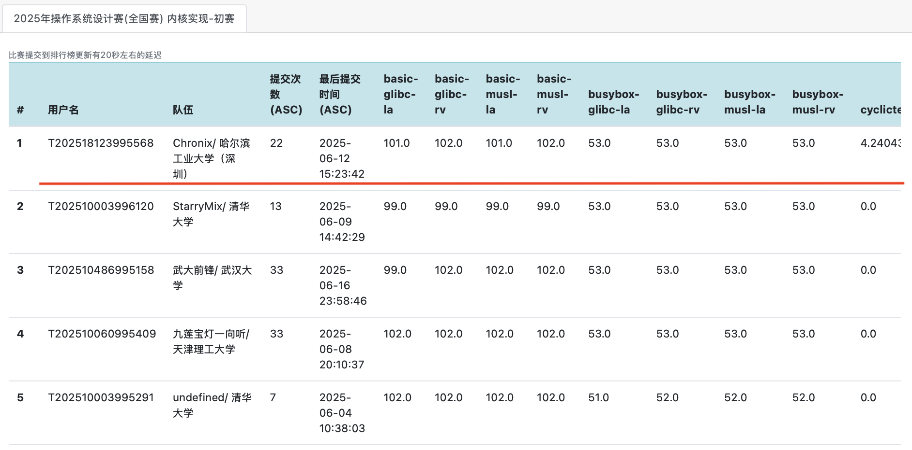

# Chronix

## 项目简介

- **Chronix** 是一个使用 Rust 实现、支持 RISCV-64 和 Loongarch-64 硬件平台的**多核宏内核操作系统**。
- “Chron” 源自希腊语 “χρόνος”（chronos），意为 “时间”。代表了我们的 OS 具有优异的实时性、强悍的性能。
- 后缀“-ix”致敬类 Unix 系统，代表了我们的 OS 具有兼容性以及开源属性。

## 完成情况

### 初赛情况

截至6月17日，Chronix 可以通过除了 LTP 之外的所有测试点*，在实时排行榜位于前列：



*：有一些测试点因为测例的原因无法通过，包括：
1. libc-test 的 glibc 的一些测试点：因为 libc-test 本身面向 musl-libc 开发，因此即便是 linux 也无法通过这些测试点。
2. cyclic-test 的 musl：因为这个测试会使用到的函数，在 musl-libc 的实现中为直接返回错误，因此本身无法正常运行。
3. lmbench 所有测试点：测评机限定运行时间，导致本地可以顺利跑完的测试，在线上提交时可能会超时。

### Chronix 内核介绍

- **进程管理**：异步无栈协程、多核调度、负载均衡。统一进程/线程模型。
- **内存管理**：应用加载按需读取、写时复制、懒分配、全局使用 SLAB 内存分配器、支持零页分配。
- **文件系统**：类 Linux 的虚拟文件系统、路径查找缓存、文件读写使用页缓存加速、支持挂载、支持 Ext4、Fat32 磁盘文件系统，内存文件系统、进程文件系统、设备文件系统。
- **信号机制**：支持标准信号与实时信号、支持用户定义信号处理。
- **设备驱动**：支持硬件中断、MMIO 驱动、PCI 驱动、串口驱动。支持设备树解析。
- **网络模块**：支持 TCP UDP 套接字、支持本地回环设备、支持 IPv4、IPv6 协议。 
- **架构管理**：自研硬件抽象层、支持 Risc-V、Loongarch 双架构。


### 文档

- [初赛文档]()

### 项目结构

```
.
├── docs                      # 文档相关
├── hal                       # 硬件抽象层
│   └── src                   
│       ├── board             # 硬件信息
│       ├── component
│       │   ├── addr          # 地址抽象
│       │   ├── console       # 调试台
│       │   ├── constant      # 架构相关常量
│       │   ├── entry         # 内核入口函数
│       │   ├── instruction   # 指令抽象
│       │   ├── irq           # 中断抽象
│       │   ├── pagetable     # 页表抽象
│       │   ├── signal        # 信号抽象
│       │   ├── timer         # 时钟抽象
│       │   └── trap          # 陷阱抽象
│       ├── interface
│       └── util
├── mk                        # 构建脚本
├── os
│   ├── cargo
│   └── src
│       ├── devices           # 设备管理
│       ├── drivers           # 驱动管理
│       ├── executor          # 任务执行器
│       ├── fs                # 文件系统
│       ├── ipc               # 进程通信
│       ├── mm                # 内存管理
│       ├── net               # 网络模块
│       ├── processor         # 处理器管理
│       ├── signal            # 信号模块
│       ├── sync              # 同步原语
│       ├── syscall           # 系统调用
│       ├── task              # 任务控制
│       ├── timer             # 计时器模块
│       ├── trap              # 陷阱处理
│       └── utils             # 工具函数
├── scripts                   # 快捷脚本
├── user                      # 用户程序
└── utils                     # 工具 crates
```

## 运行方式

### 编译
在项目的根目录运行

```bash
make all
```

以编译得到磁盘镜像以及内核可执行文件

### 运行

运行：

```bash
make run-rv
```

以启动 Riscv 架构的内核；

运行：

```bash
make run-la
```

以启动 Loongarch 架构的内核；

## 项目人员

哈尔滨工业大学（深圳）：
- 肖嘉誉(3028079152@qq.com)：文件系统、信号机制、项目构建
- 欧阳天麟(2199288762@qq.com)：网络模块、进程管理、时间管理
- 周立诚(2023311325@stu.hit.edu.cn)：内存管理、硬件抽象层
- 指导老师：夏文，仇洁婷

## 参考

- [Phoenix](https://github.com/ChenRuiwei/Phoenix.git) 虚拟文件系统、设备管理部分设计
- [PolyHal](https://github.com/Byte-OS/polyhal.git) 硬件抽象层设计
- [Titanix](https://github.com/greenhandzpx/Titanix.git) 动态链接、信号机制实现思路
- [lunaix-OS](https://github.com/Minep/lunaix-os.git) 页缓存逻辑