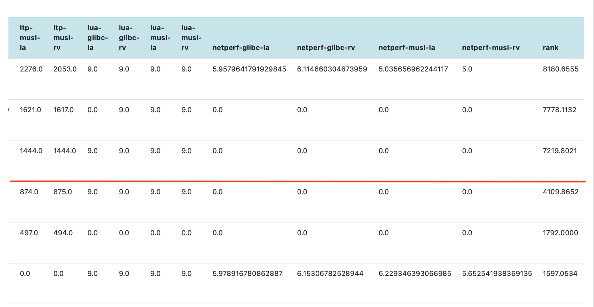
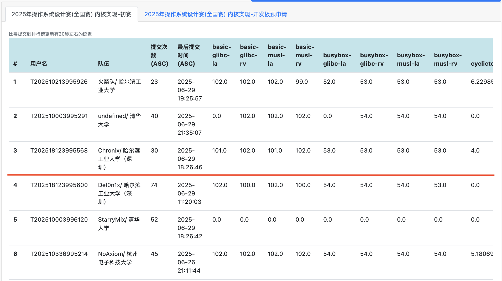
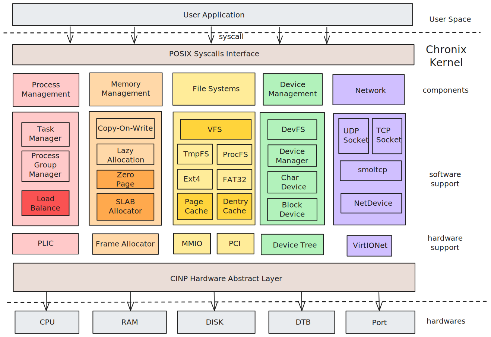

# Chronix

## 项目简介

- **Chronix** 是一个使用 Rust 实现、支持 RISCV-64 和 Loongarch-64 硬件平台的**多核宏内核操作系统**。
- “Chron” 源自希腊语 “χρόνος”（chronos），意为 “时间”。代表了我们的 OS 具有优异的实时性、强悍的性能。
- 后缀“-ix”致敬类 Unix 系统，代表了我们的 OS 具有兼容性以及开源属性。

## 完成情况

### 初赛情况

截至6月29日23点，Chronix 已经通过初赛的大部分测试点，并在实时排行榜上位于前列：






### Chronix 内核介绍

- **进程管理**：异步无栈协程、多核调度、负载均衡。统一进程/线程模型。
- **内存管理**：Chronix 支持了内核空间的动态映射，通过改造 xmas-elf 实现应用的按需加载、写时复制（Copy-on-Write）、懒分配（Lazy Allocation）等优化策略，并全局使用 SLAB 内存分配器，支持零页分配，以最小化内存开销并提升性能。使用了用户指针检查来确保安全性。
- **文件系统**：Chronix 提供类 Linux 的虚拟文件系统（VFS）架构，支持路径查找缓存（Dentry Cache）和页缓存加速文件读写。同时，它兼容多种文件系统，包括 Ext4、Fat32 等磁盘文件系统，以及内存文件系统（tmpfs）、进程文件系统（procfs）和设备文件系统（devfs），并支持灵活的挂载机制。
- **信号机制**：支持标准信号和实时信号，符合 linux 的信号排队机制，允许用户自定义信号处理逻辑，满足不同应用场景的需求。
- **设备驱动**：Chronix 支持硬件中断、MMIO（内存映射 I/O）、PCI 设备驱动以及串口通信，并内置设备树（Device Tree）解析功能，便于硬件资源的动态管理。
- **网络模块**：Chronix 实现了 TCP/UDP 套接字通信，支持本地回环设备（Loopback），并兼容 IPv4 和 IPv6 协议栈，为现代网络应用提供稳定高效的通信能力。
- **架构管理**：使其能够灵活支持多种处理器架构，目前已经适配 RISC-V 和 LoongArch，未来可以扩展到更多平台。




### 文档

- [初赛文档](https://github.com/PACTHEMAN123/Chronix/blob/main/Chronix-%E5%88%9D%E8%B5%9B%E6%96%87%E6%A1%A3.pdf)
- [初赛总结幻灯片](https://github.com/PACTHEMAN123/Chronix/blob/main/Chronix-%E5%88%9D%E8%B5%9BPPT.pdf)
- [初赛演示视频](https://pan.baidu.com/s/1byWv4IZ0vpMvu4rNXoEllA) 提取码：xvru

### 项目结构

```
.
├── docs                      # 文档相关
├── hal                       # 硬件抽象层
│   └── src                   
│       ├── board             # 硬件信息
│       ├── component
│       │   ├── addr          # 地址抽象
│       │   ├── console       # 调试台
│       │   ├── constant      # 架构相关常量
│       │   ├── entry         # 内核入口函数
│       │   ├── instruction   # 指令抽象
│       │   ├── irq           # 中断抽象
│       │   ├── pagetable     # 页表抽象
│       │   ├── signal        # 信号抽象
│       │   ├── timer         # 时钟抽象
│       │   └── trap          # 陷阱抽象
│       ├── interface
│       └── util
├── mk                        # 构建脚本
├── os
│   ├── cargo
│   └── src
│       ├── devices           # 设备管理
│       ├── drivers           # 驱动管理
│       ├── executor          # 任务执行器
│       ├── fs                # 文件系统
│       ├── ipc               # 进程通信
│       ├── mm                # 内存管理
│       ├── net               # 网络模块
│       ├── processor         # 处理器管理
│       ├── signal            # 信号模块
│       ├── sync              # 同步原语
│       ├── syscall           # 系统调用
│       ├── task              # 任务控制
│       ├── timer             # 计时器模块
│       ├── trap              # 陷阱处理
│       └── utils             # 工具函数
├── scripts                   # 快捷脚本
├── user                      # 用户程序
└── utils                     # 工具 crates
```

## 运行方式

### 编译
在项目的根目录运行

```bash
make all
```

以编译得到磁盘镜像以及内核可执行文件

### 运行

运行：

```bash
make run-rv
```

以启动 Riscv 架构的内核；

运行：

```bash
make run-la
```

以启动 Loongarch 架构的内核；

## 项目人员

哈尔滨工业大学（深圳）：
- 肖嘉誉(3028079152@qq.com)：文件系统、信号机制、项目构建
- 欧阳天麟(2199288762@qq.com)：网络模块、进程管理、时间管理
- 周立诚(2023311325@stu.hit.edu.cn)：内存管理、硬件抽象层
- 指导老师：夏文，仇洁婷

## 参考

- [Phoenix](https://github.com/ChenRuiwei/Phoenix.git) 虚拟文件系统、设备管理部分设计
- [PolyHal](https://github.com/Byte-OS/polyhal.git) 硬件抽象层设计
- [Titanix](https://github.com/greenhandzpx/Titanix.git) 动态链接、信号机制实现思路
- [lunaix-OS](https://github.com/Minep/lunaix-os.git) 页缓存逻辑
- [MankorOS](https://github.com/mankoros/mankoros) 设备树解析、部分驱动实现
- [ArceOS](https://github.com/arceos-org/arceos) 网络模块的部分设计
